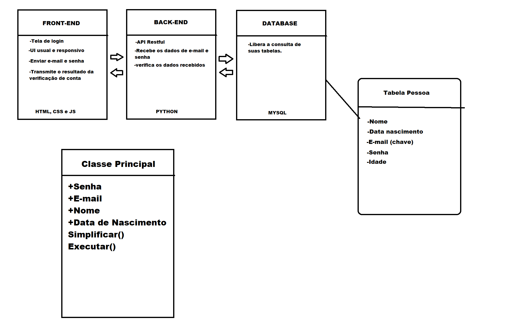

<h1> Cadastro </h1>

<h2> Descrição </h2>

Este sistema tem por objetivo realizar um 
cadastro eficiente de usuários.

<h2>Status do Projeto</h2>

 Em desenvolvimento 

<h2> Funcionalidades </h2>

<ul>
<li> Cadastrar usuários</li>
<li> Logar em sua conta </li>
<li> Editar informações cadastrais (em desenvolvimento) </li>
</ul>

<h2> Diagrama UML </h2>

<h2> Acesso ao Projeto</h2>

<ol>

<li>
Deve-se habilitar um servidor MySQL. O XAMPP é uma
boa ferramenta.
</li>

<li>
Importe a estrutura de banco de dados dentro do MySQL.
A estrutura pode ser encontrada no seguinte caminho:
Model/dump
</li>

<li>
Execute o arquivo 'Controller/API.py'. Criando assim, outro servidor
local. Pycharm pode ser utilizado para isto.
</li>

<li>
Execute o arquivo 'View/Perfil/index.html'
</li>
</ol>

OBS: Lembre-se, edite o caminho dos arquivos de acordo com sua
máquina. Dentro do arquivo 'Controller/API.py' mude o usuário e a senha
do servidor MySQL de acordo com o seu. Vale lembrar, que seria bem
usual habilitar o live server para abrir os arquivos dentro da pasta
'View'.

<h2> Técnicas e Tecnologias utilizadas </h2>

<h4> BACK-END</h4>

<ul>

<li>API REST em python Flask</li>
<li> Programação Orientada a Objetos </li>
<li>Banco de dados MySQL </li>

</ul>

<h4> FRONT-END</h4>

<ul>
<li> JavaScript </li>
<li> HTML 5 </li>
<li> CSS 3 </li>
<li> Requisições com Fetch api</li>
</ul>

<h4> ARQUITETURA </h4>

-MVC

<h2> Autores </h2>
<ul><li>Felipe Vieira da Silva</li></ul>

<h2> Licença </h2>
<ul>
<li> MIT Licensed</li>
</ul>
